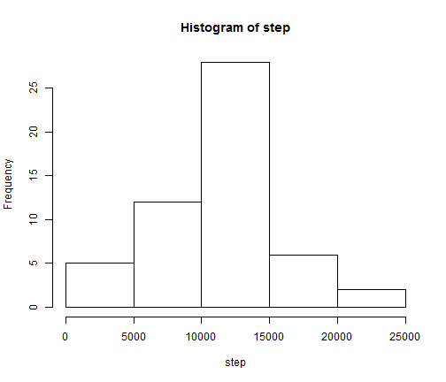
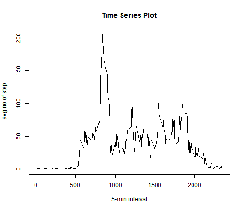
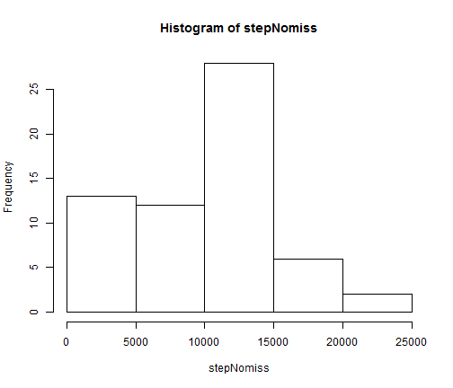
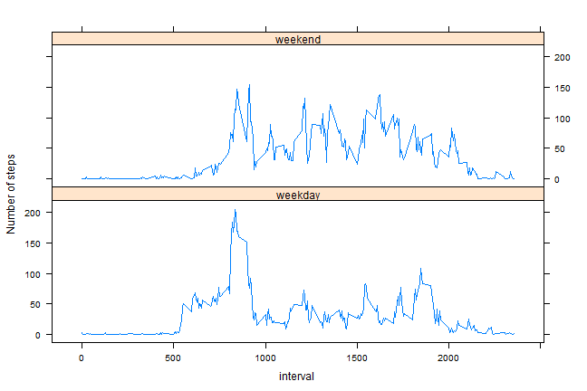

# Reproducible Research: Peer Assessment 1


## Loading and preprocessing the data

```r
setwd("e://courses//jh-dataexplore//ws_research//RepData_PeerAssessment1")
data <- read.csv("activity.csv")
# sum up the steps per date, and get the steps
step <- aggregate(steps ~ date, data, sum)$steps
step
```

```
##  [1]   126 11352 12116 13294 15420 11015 12811  9900 10304 17382 12426
## [12] 15098 10139 15084 13452 10056 11829 10395  8821 13460  8918  8355
## [23]  2492  6778 10119 11458  5018  9819 15414 10600 10571 10439  8334
## [34] 12883  3219 12608 10765  7336    41  5441 14339 15110  8841  4472
## [45] 12787 20427 21194 14478 11834 11162 13646 10183  7047
```


```r
hist(step)
```

 


## What is mean total number of steps taken per day?
mean and median is given below

```r
mean(step)
```

```
## [1] 10766
```

```r
median(step)
```

```
## [1] 10765
```


## What is the average daily activity pattern?

```r
library(plyr)
stepdate <- ddply(data, .(interval), summarize, steps = mean(steps, na.rm = T))
```


```r
plot(stepdate$interval, stepdate$steps, type = "l", ylab = "avg no of step", 
    xlab = "5-min interval", main = "Time Series Plot")
```

 


interval that contains the maximum number of step

```r
stepdate[stepdate$steps == max(stepdate$steps), ]$interval
```

```
## [1] 835
```


## Imputing missing values


```r
print("number of rows with missing value")
```

```
## [1] "number of rows with missing value"
```

```r
nrow(data[is.na(data), ])
```

```
## [1] 2304
```


Strategy for filling in all of the missing values in the dataset:
calcuate the median of each 5-min interval for the whole day.  and use this to
fill in the missing value

```r
data.nomiss <- data
intMedian <- ddply(data.nomiss, .(interval), summarize, steps = median(steps, 
    na.rm = T))
data.nomiss[is.na(data.nomiss)] = intMedian$steps
stepNomiss <- aggregate(steps ~ date, data.nomiss, sum)$steps
```


### histogram with missing data estimated

```r
hist(stepNomiss)
```

 


### mean and median of dataset with missing data estimated?
mean and median is given below

```r
mean(stepNomiss)
```

```
## [1] 9504
```

```r
median(stepNomiss)
```

```
## [1] 10395
```

```r
print("This differ from values of the dataset that has missing values as follows")
```

```
## [1] "This differ from values of the dataset that has missing values as follows"
```

```r
mean(step)
```

```
## [1] 10766
```

```r
median(step)
```

```
## [1] 10765
```


## Are there differences in activity patterns between weekdays and weekends?

method to create the appropriate dataframe required for plotting
(1) add a column "day" to the dataframe default the value to "weekday"
(2) change the value of this to weekend, if the date is either Saturday or Sunday
(3) get the mean of each interval of the day and group it by weekday and weekend into another dataframe
(4) use this dataframe (obtained in step3 ) for plotting

```r
data.nomiss$day = "weekday"
data.nomiss[weekdays(as.Date(data.nomiss$date, "%Y-%m-%d")) == "Sunday" | weekdays(as.Date(data.nomiss$date, 
    "%Y-%m-%d")) == "Saturday", ]$day = "weekend"
stepdate.nomiss <- ddply(data.nomiss, .(interval, day), summarize, steps = mean(steps, 
    na.rm = T))
```


use lattice to plot the graph

```r
library(lattice)
xyplot(steps ~ interval | day, data = stepdate.nomiss, type = "l", layout = c(1, 
    2), ylab = "Number of steps")
```

 

